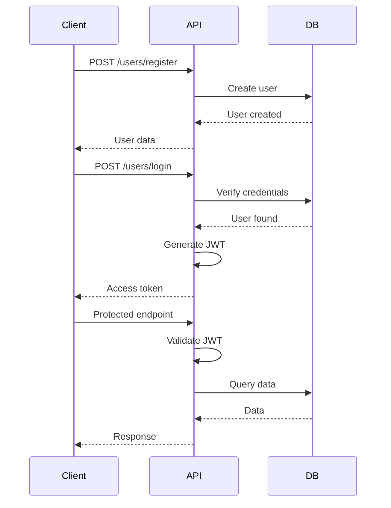

# 📡 API Usage Guide

Complete API reference for YanZhuShou Question Bank Management System.

## Base URL

```
http://localhost:8000
```

## Interactive Documentation

- **Swagger UI**: http://localhost:8000/docs
- **ReDoc**: http://localhost:8000/redoc

---

## 🔐 Authentication

### Register User

```http
POST /users/register
Content-Type: application/json
```

**Request Body:**
```json
{
  "email": "teacher@example.com",
  "name": "John Teacher",
  "password": "securepass123",
  "phone": "13800138000",
  "gender": 1
}
```

**Response (201 Created):**
```json
{
  "user_id": 1,
  "email": "teacher@example.com",
  "name": "John Teacher",
  "phone": "13800138000",
  "gender": 1,
  "created_at": "2024-01-15T10:30:00"
}
```

---

### Login

```http
POST /users/login
Content-Type: application/x-www-form-urlencoded
```

**Request Body:**
```
username=teacher@example.com
password=securepass123
```

**Response (200 OK):**
```json
{
  "access_token": "eyJhbGciOiJIUzI1NiIsInR5cCI6IkpXVCJ9...",
  "token_type": "bearer"
}
```

---

### Get Current User

```http
GET /users/me
Authorization: Bearer <token>
```

**Response (200 OK):**
```json
{
  "user_id": 1,
  "email": "teacher@example.com",
  "name": "John Teacher",
  "phone": "13800138000",
  "gender": 1,
  "created_at": "2024-01-15T10:30:00"
}
```

---

### Update Current User

```http
PUT /users/me
Authorization: Bearer <token>
Content-Type: application/json
```

**Request Body:**
```json
{
  "name": "John Updated",
  "phone": "13900139000"
}
```

---

## 📚 Question Banks

### Create Question Bank

```http
POST /question_banks/book
Authorization: Bearer <token>
Content-Type: application/json
```

**Request Body:**
```json
{
  "name": "Mathematics 101",
  "is_public": false,
  "description": "Basic mathematics questions"
}
```

**Response (201 Created):**
```json
{
  "bank_id": 1,
  "name": "Mathematics 101",
  "user_id": 1,
  "is_public": false,
  "description": "Basic mathematics questions",
  "created_at": "2024-01-15T10:35:00"
}
```

---

## 📤 Question Upload

### Upload Single Question

```http
POST /upload/question
Authorization: Bearer <token>
Content-Type: application/json
```

**Request Body:**
```json
{
  "bank_id": 1,
  "category": "Algebra",
  "stem": "Solve for x: 2x + 3 = 7",
  "qus_type": 2,
  "options": ["x=1", "x=2", "x=3", "x=4"],
  "correct_ans_summary": "x=2",
  "full_text": "Solve for x: 2x + 3 = 7. Show your work.",
  "full_answer": "x = 2\n\nStep 1: 2x = 7 - 3\nStep 2: 2x = 4\nStep 3: x = 2",
  "explanation": "Subtract 3 from both sides, then divide by 2."
}
```

---

### Upload CSV File

```http
POST /upload/csv
Authorization: Bearer <token>
Content-Type: multipart/form-data
```

**Request Body:**
```
bank_id: 1
file: @questions.csv
```

**CSV Format:**
```csv
category,stem,qus_type,options,correct_ans_summary,full_text,full_answer,explanation
Algebra,"Solve for x: 2x + 3 = 7",2,"x=1|x=2|x=3|x=4",x=2,"Solve for x: 2x + 3 = 7","x = 2","Subtract 3, divide by 2"
```

**Response (200 OK):**
```json
{
  "message": "CSV upload successful",
  "questions_added": 3,
  "bank_id": 1
}
```

---

### Upload XML File

```http
POST /upload/xml
Authorization: Bearer <token>
Content-Type: multipart/form-data
```

**Request Body:**
```
bank_id: 1
file: @questions.xml
```

**XML Format:**
```xml
<?xml version="1.0" encoding="UTF-8"?>
<questions>
  <question>
    <category>Algebra</category>
    <stem>Solve for x: 2x + 3 = 7</stem>
    <qus_type>2</qus_type>
    <options>
      <option>x=1</option>
      <option>x=2</option>
      <option>x=3</option>
      <option>x=4</option>
    </options>
    <correct_ans_summary>x=2</correct_ans_summary>
    <full_text>Solve for x: 2x + 3 = 7</full_text>
    <full_answer>x = 2</full_answer>
    <explanation>Subtract 3, divide by 2</explanation>
  </question>
</questions>
```

**Response (200 OK):**
```json
{
  "message": "XML upload successful",
  "questions_added": 5,
  "bank_id": 1
}
```

---

## 📓 Mistake Notebook

### Add Question to Mistakes

```http
POST /mistake/add
Authorization: Bearer <token>
Content-Type: application/json
```

**Request Body:**
```json
{
  "question_no": 1
}
```

---

### Get My Mistakes

```http
GET /mistake/list
Authorization: Bearer <token>
```

**Response (200 OK):**
```json
{
  "mistakes": [
    {
      "id": 1,
      "question_no": 5,
      "question_stem": "Solve for x: 2x + 3 = 7",
      "bank_name": "Mathematics 101",
      "added_at": "2024-01-15T11:00:00"
    }
  ],
  "total": 1
}
```

---

### Remove from Mistakes

```http
DELETE /mistake/remove/{question_no}
Authorization: Bearer <token>
```

**Response (200 OK):**
```json
{
  "message": "Question removed from mistakes"
}
```

---

## 💬 Feedback

### Submit Feedback

```http
POST /api/feedback
Authorization: Bearer <token>
Content-Type: application/json
```

**Request Body:**
```json
{
  "content": "The CSV upload is slow for large files",
  "type": "bug"
}
```

**Response (201 Created):**
```json
{
  "id": 1,
  "user_id": 1,
  "content": "The CSV upload is slow for large files",
  "type": "bug",
  "status": "pending",
  "created_at": "2024-01-15T12:00:00"
}
```

---

### Get My Feedback

```http
GET /api/feedback/my
Authorization: Bearer <token>
```

**Response (200 OK):**
```json
{
  "feedback": [
    {
      "id": 1,
      "content": "The CSV upload is slow for large files",
      "type": "bug",
      "status": "pending",
      "created_at": "2024-01-15T12:00:00"
    }
  ],
  "total": 1
}
```

---

## 🔒 Error Responses

### 400 Bad Request
```json
{
  "detail": "Invalid input data"
}
```

### 401 Unauthorized
```json
{
  "detail": "Invalid or expired token"
}
```

### 403 Forbidden
```json
{
  "detail": "Not authorized to access this resource"
}
```

### 404 Not Found
```json
{
  "detail": "Resource not found"
}
```

### 500 Internal Server Error
```json
{
  "detail": "Internal server error"
}
```

---

## 📊 Question Types

| Type ID | Name | Description |
|---------|------|-------------|
| 1 | Essay | Open-ended text response |
| 2 | Single-choice | One correct option |
| 3 | Multiple-choice | Multiple correct options |
| 4 | Fill-in | Fill in the blank |

---

## 📝 Feedback Types

| Type | Description |
|------|-------------|
| `bug` | Bug report |
| `feature` | Feature request |
| `general` | General feedback |

---

## 🔑 Authentication Flow



---

## Related Documentation

- [Project Structure](PROJECT_STRUCTURE.md) - Code organization
- [Database Schema](DATABASE_SCHEMA.md) - Database details
- [README](../README.md) - Quick start and setup guide
