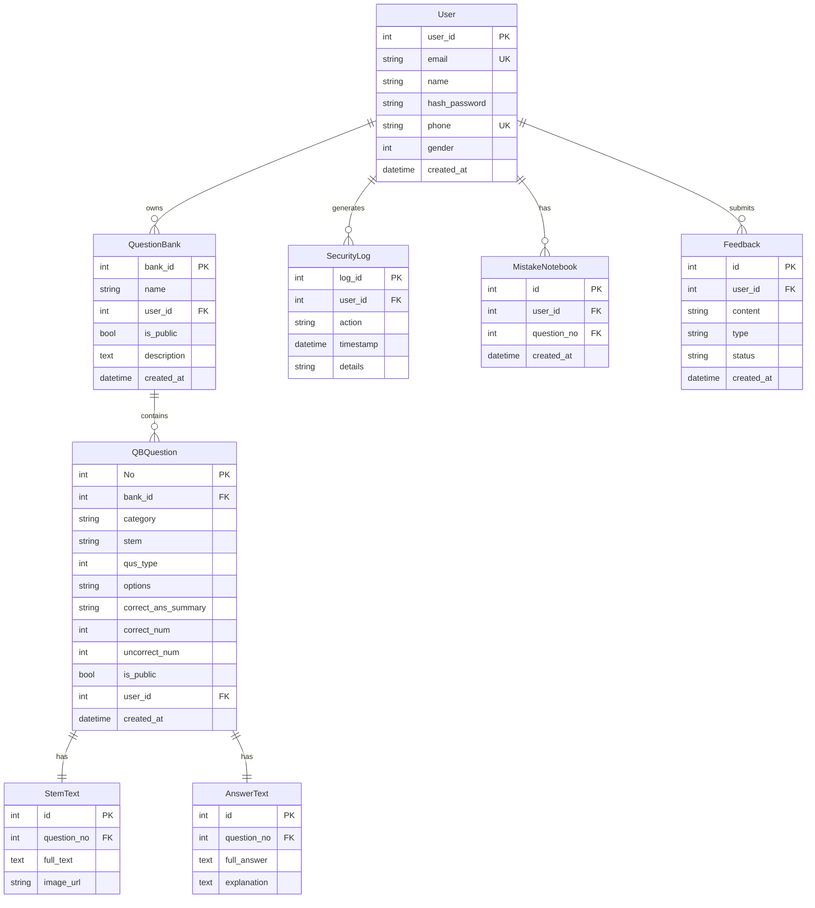

# 🗄️ Database Schema

Complete database schema documentation for YanZhuShou.

## Entity Relationship Diagram



## Table Descriptions

### `User`
Stores user account information including authentication credentials.

| Column | Type | Constraints | Description |
|--------|------|-------------|-------------|
| `user_id` | INTEGER | PRIMARY KEY | Auto-incrementing user ID |
| `email` | VARCHAR | UNIQUE, NOT NULL | User email (login username) |
| `name` | VARCHAR | NOT NULL | Display name |
| `hash_password` | VARCHAR | NOT NULL | Bcrypt hashed password |
| `phone` | VARCHAR | UNIQUE | Phone number |
| `gender` | INTEGER | | Gender (0: Unknown, 1: Male, 2: Female) |
| `created_at` | TIMESTAMP | DEFAULT NOW() | Account creation timestamp |

### `QuestionBank`
Represents a collection of questions (like a textbook or course).

| Column | Type | Constraints | Description |
|--------|------|-------------|-------------|
| `bank_id` | INTEGER | PRIMARY KEY | Auto-incrementing bank ID |
| `name` | VARCHAR | NOT NULL | Question bank name |
| `user_id` | INTEGER | FK → User | Owner user ID |
| `is_public` | BOOLEAN | DEFAULT FALSE | Public visibility flag |
| `description` | TEXT | | Bank description |
| `created_at` | TIMESTAMP | DEFAULT NOW() | Creation timestamp |

### `QBQuestion`
Individual questions within a question bank with metadata.

| Column | Type | Constraints | Description |
|--------|------|-------------|-------------|
| `No` | INTEGER | PRIMARY KEY | Auto-incrementing question number |
| `bank_id` | INTEGER | FK → QuestionBank | Parent question bank |
| `category` | VARCHAR | | Question category |
| `stem` | TEXT | | Question stem (short) |
| `qus_type` | INTEGER | | Question type (1: Essay, 2: Single-choice, 3: Multiple-choice, 4: Fill-in) |
| `options` | JSONB | | Answer options (for choice questions) |
| `correct_ans_summary` | TEXT | | Correct answer summary |
| `correct_num` | INTEGER | DEFAULT 0 | Count of correct attempts |
| `uncorrect_num` | INTEGER | DEFAULT 0 | Count of incorrect attempts |
| `is_public` | BOOLEAN | DEFAULT FALSE | Public visibility flag |
| `user_id` | INTEGER | FK → User | Creator user ID |
| `created_at` | TIMESTAMP | DEFAULT NOW() | Creation timestamp |

### `StemText`
Extended question content including full text and images.

| Column | Type | Constraints | Description |
|--------|------|-------------|-------------|
| `id` | INTEGER | PRIMARY KEY | Auto-incrementing ID |
| `question_no` | INTEGER | FK → QBQuestion | Reference to question |
| `full_text` | TEXT | | Complete question text |
| `image_url` | VARCHAR | | Optional image URL |

### `AnswerText`
Correct answers and explanations for questions.

| Column | Type | Constraints | Description |
|--------|------|-------------|-------------|
| `id` | INTEGER | PRIMARY KEY | Auto-incrementing ID |
| `question_no` | INTEGER | FK → QBQuestion | Reference to question |
| `full_answer` | TEXT | | Complete answer text |
| `explanation` | TEXT | | Answer explanation |

### `MistakeNotebook`
User's personal collection of incorrectly answered questions.

| Column | Type | Constraints | Description |
|--------|------|-------------|-------------|
| `id` | INTEGER | PRIMARY KEY | Auto-incrementing ID |
| `user_id` | INTEGER | FK → User | Owner user ID |
| `question_no` | INTEGER | FK → QBQuestion | Reference to question |
| `created_at` | TIMESTAMP | DEFAULT NOW() | Added timestamp |

### `Feedback`
User feedback submissions for the application.

| Column | Type | Constraints | Description |
|--------|------|-------------|-------------|
| `id` | INTEGER | PRIMARY KEY | Auto-incrementing ID |
| `user_id` | INTEGER | FK → User | Submitting user |
| `content` | TEXT | NOT NULL | Feedback content |
| `type` | VARCHAR | | Feedback type (bug, feature, general) |
| `status` | VARCHAR | DEFAULT 'pending' | Review status |
| `created_at` | TIMESTAMP | DEFAULT NOW() | Submission timestamp |

### `SecurityLog`
Audit trail of user actions for security monitoring.

| Column | Type | Constraints | Description |
|--------|------|-------------|-------------|
| `log_id` | INTEGER | PRIMARY KEY | Auto-incrementing ID |
| `user_id` | INTEGER | FK → User | Acting user |
| `action` | VARCHAR | NOT NULL | Action performed |
| `timestamp` | TIMESTAMP | DEFAULT NOW() | Action timestamp |
| `details` | JSONB | | Action details/metadata |

## Relationships

### One-to-Many

| Parent | Child | Description |
|--------|-------|-------------|
| User | QuestionBank | A user can own multiple question banks |
| User | SecurityLog | A user can have many security log entries |
| User | MistakeNotebook | A user can have many mistake entries |
| User | Feedback | A user can submit multiple feedback items |
| QuestionBank | QBQuestion | A question bank can contain many questions |

### One-to-One

| Parent | Child | Description |
|--------|-------|-------------|
| QBQuestion | StemText | Each question has one stem text extension |
| QBQuestion | AnswerText | Each question has one answer text extension |

## Indexes

Recommended indexes for performance:

```sql
-- User lookups
CREATE INDEX idx_user_email ON User(email);
CREATE INDEX idx_user_phone ON User(phone);

-- QuestionBank queries
CREATE INDEX idx_bank_user_id ON QuestionBank(user_id);
CREATE INDEX idx_bank_is_public ON QuestionBank(is_public);

-- Question queries
CREATE INDEX idx_question_bank_id ON QBQuestion(bank_id);
CREATE INDEX idx_question_user_id ON QBQuestion(user_id);
CREATE INDEX idx_question_type ON QBQuestion(qus_type);

-- Mistake tracking
CREATE INDEX idx_mistake_user_id ON MistakeNotebook(user_id);

-- Security logs
CREATE INDEX idx_log_user_id ON SecurityLog(user_id);
CREATE INDEX idx_log_timestamp ON SecurityLog(timestamp);
```

## Related Documentation

- [Project Structure](PROJECT_STRUCTURE.md) - Code organization
- [API Usage](API_USAGE.md) - API endpoints and examples
- [README](../README.md) - Quick start and setup guide
