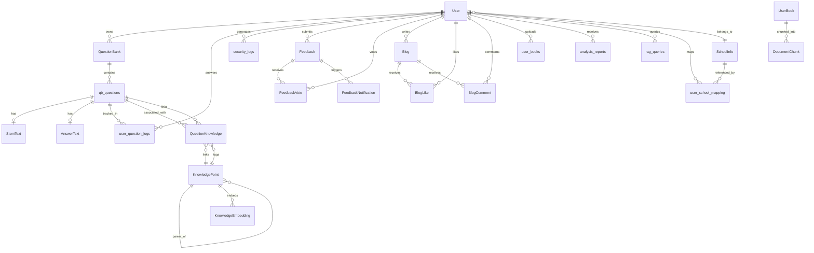

# 数据库架构文档

> 本文档描述燕助手后端数据库的表结构、关联关系及设计原理。
> 数据库: PostgreSQL | ORM: SQLAlchemy (异步 asyncpg)

---

## 一、实体关系图 (ER Diagram)



---

## 二、模块概览

数据库共 **24 张表**，按功能域划分为 **8 个模块**:

| 模块 | 表 | 说明 |
|------|-----|------|
| 用户管理 | `User` | 用户账户与基本信息 |
| 题库系统 | `question_banks`, `qb_questions`, `stem_text`, `answer_text` | 题目创建、存储与分类 |
| 学习追踪 | `user_question_logs`, `security_logs` | 答题记录与安全审计 |
| 错题本 | (复用 `user_question_logs`) | 通过 `is_correct = false` 筛选错题 |
| 社区博客 | `blogs`, `blog_likes`, `blog_comments` | 用户内容发布与互动 |
| 反馈系统 | `Feedback`, `FeedbackVote`, `FeedbackNotification` | 用户反馈与投票 |
| 知识图谱 | `knowledge_points`, `question_knowledge`, `knowledge_embeddings` | 知识点层级与题目关联 |
| RAG 检索 | `document_chunks`, `rag_queries` | 文档分块与向量检索 |
| 书籍管理 | `user_books` | 用户上传书籍与知识提取 |
| 分析报告 | `analysis_reports` | AI 生成的分析报告 |
| 学校信息 | `school_info`, `user_school_mapping` | 院校信息与用户关联 |

---

## 三、表结构详解

### 3.1 用户模块

#### `User` — 用户表

| 字段 | 类型 | 约束 | 说明 |
|------|------|------|------|
| `user_id` | Integer | PK, AUTO | 用户 ID |
| `email` | String(100) | UNIQUE, NOT NULL | 邮箱（登录凭证） |
| `name` | String(50) | NOT NULL | 姓名 |
| `hash_password` | String(255) | NOT NULL | 密码哈希 |
| `phone` | String(20) | UNIQUE | 手机号 |
| `gender` | SmallInteger | DEFAULT 0 | 0=未知, 1=男, 2=女 |
| `role` | String(20) | NOT NULL, DEFAULT "user" | 角色: user / admin / developer |
| `bio_file_path` | String(255) | | 个人简介 Markdown 文件路径 |
| `created_at` | DateTime | DEFAULT now() | 注册时间 |

**设计原理**: 密码存储哈希值而非明文；`role` 字段用于 RBAC 权限控制；`bio_file_path` 将大文本内容外置为文件，避免数据库膨胀。

---

### 3.2 题库模块

#### `question_banks` — 题库表

| 字段 | 类型 | 约束 | 说明 |
|------|------|------|------|
| `bank_id` | Integer | PK, AUTO | 题库 ID |
| `name` | String(100) | NOT NULL | 题库名称 |
| `user_id` | Integer | FK → User.user_id, CASCADE | 创建者 |
| `is_public` | Boolean | DEFAULT false | 是否公开 |
| `description` | Text | | 题库描述 |
| `created_at` | DateTime | DEFAULT now() | 创建时间 |

**关系**: User `1:N` QuestionBank；QuestionBank `1:N` QBQuestion

#### `qb_questions` — 题目表

| 字段 | 类型 | 约束 | 说明 |
|------|------|------|------|
| `No` | Integer | PK, AUTO | 题目编号 |
| `bank_id` | Integer | FK → question_banks.bank_id, SET NULL | 所属题库 |
| `category` | String(50) | NOT NULL | 学科/主题分类 |
| `stem` | String(255) | NOT NULL | 题干摘要（列表预览用） |
| `qus_type` | SmallInteger | DEFAULT 1 | 0=解答, 1=单选, 2=多选, 3=填空 |
| `options` | String | | 选项 JSON 字符串 |
| `correct_ans_summary` | String(255) | | 答案摘要 |
| `correct_num` | Integer | DEFAULT 0 | 答对人数 |
| `uncorrect_num` | Integer | DEFAULT 0 | 答错人数 |
| `is_public` | Boolean | DEFAULT true | 是否公开 |
| `user_id` | Integer | FK → User.user_id, SET NULL | 上传者 (NULL=系统题) |
| `created_at` | DateTime | DEFAULT now() | 创建时间 |

**关系**: QuestionBank `1:N` QBQuestion；QBQuestion `1:1` StemText；QBQuestion `1:1` AnswerText；QBQuestion `1:N` UserQuestionLog

**设计原理**: `stem` 字段用于列表页快速展示，避免加载大文本；`options` 以 JSON 字符串存储以保持灵活性；`correct_num`/`uncorrect_num` 统计全局答题正确率。

#### `stem_text` — 题干全文表

| 字段 | 类型 | 约束 | 说明 |
|------|------|------|------|
| `id` | Integer | PK, AUTO | 主键 |
| `question_no` | Integer | FK → qb_questions.No, CASCADE, UNIQUE | 题目编号 |
| `full_text` | Text | NOT NULL | 题干完整文本 |

**设计原理**: 将大文本 (Text) 与题目主表分离，提升列表查询性能。`UNIQUE` 保证一题一文本。

#### `answer_text` — 答案解析表

| 字段 | 类型 | 约束 | 说明 |
|------|------|------|------|
| `id` | Integer | PK, AUTO | 主键 |
| `question_no` | Integer | FK → qb_questions.No, CASCADE, UNIQUE | 题目编号 |
| `full_answer` | Text | NOT NULL | 完整正确答案 |
| `explanation` | Text | | 解题过程/解析 |

**设计原理**: 答案与题目主体分离，支持独立更新答案解析而不改动题目元数据。

---

### 3.3 学习追踪模块

#### `user_question_logs` — 答题记录表

| 字段 | 类型 | 约束 | 说明 |
|------|------|------|------|
| `id` | Integer | PK, AUTO | 主键 |
| `user_id` | Integer | FK → User.user_id, CASCADE, INDEX | 用户 ID |
| `question_no` | Integer | FK → qb_questions.No, CASCADE, INDEX | 题目编号 |
| `user_answer` | String | | 用户答案 |
| `is_correct` | Boolean | NOT NULL | 是否正确 |
| `attempt_time` | DateTime | DEFAULT now() | 答题时间 |
| `is_mastered` | Boolean | DEFAULT false | 用户标记为已掌握 |

**关系**: User `1:N` UserQuestionLog；QBQuestion `1:N` UserQuestionLog

**设计原理**: 同时索引 `user_id` 和 `question_no`，支持按用户查答题历史、按题目查答题统计。**错题本功能复用此表**，只需筛选 `is_correct = false` 即可，无需额外建表。

#### `security_logs` — 安全日志表

| 字段 | 类型 | 约束 | 说明 |
|------|------|------|------|
| `id` | Integer | PK, AUTO | 主键 |
| `user_id` | Integer | FK → User.user_id, CASCADE | 用户 ID |
| `ip_address` | String(45) | NOT NULL | IP 地址 (支持 IPv6) |
| `device_info` | String(255) | | 设备信息 |
| `action_type` | String(50) | | 动作类型: LOGIN_SUCCESS, LOGIN_FAIL, UNAUTHORIZED_ACCESS |
| `created_at` | DateTime | DEFAULT now() | 记录时间 |

**设计原理**: 用于安全审计和异常检测，如频繁登录失败、异地登录等。

---

### 3.4 反馈模块

#### `Feedback` — 反馈表

| 字段 | 类型 | 约束 | 说明 |
|------|------|------|------|
| `id` | Integer | PK, AUTO | 反馈 ID |
| `user_id` | Integer | FK → User.user_id, CASCADE | 提交者 |
| `content` | Text | NOT NULL | 反馈内容 |
| `category` | String(50) | DEFAULT "other" | 分类: bug / feature / ui / performance / documentation / other |
| `status` | String(50) | DEFAULT "pending" | 状态: pending / in_progress / completed / rejected |
| `vote_count` | Integer | DEFAULT 0 | 投票数 |
| `developer_response` | Text | | 开发者回复 |
| `responded_at` | DateTime | | 回复时间 |
| `resolved_at` | DateTime | | 解决时间 |
| `created_at` | DateTime | DEFAULT now() | 创建时间 |
| `updated_at` | DateTime | DEFAULT now(), ON UPDATE | 更新时间 |

**关系**: User `1:N` Feedback；Feedback `1:N` FeedbackVote；Feedback `1:N` FeedbackNotification

#### `FeedbackVote` — 反馈投票表

| 字段 | 类型 | 约束 | 说明 |
|------|------|------|------|
| `id` | Integer | PK, AUTO | 投票 ID |
| `feedback_id` | Integer | FK → Feedback.id, CASCADE | 反馈 ID |
| `user_id` | Integer | FK → User.user_id, CASCADE | 投票者 |
| `created_at` | DateTime | DEFAULT now() | 投票时间 |

**约束**: UNIQUE(feedback_id, user_id) — 每个用户对每条反馈只能投一票

**设计原理**: 唯一约束防止重复投票；`vote_count` 冗余存储在 Feedback 表以避免每次统计时 COUNT，提升查询性能。

#### `FeedbackNotification` — 反馈通知表

| 字段 | 类型 | 约束 | 说明 |
|------|------|------|------|
| `id` | Integer | PK, AUTO | 通知 ID |
| `feedback_id` | Integer | FK → Feedback.id, CASCADE | 反馈 ID |
| `notified_at` | DateTime | DEFAULT now() | 通知时间 |
| `notification_type` | String(50) | NOT NULL | 类型: threshold_reached, status_changed 等 |
| `is_sent` | SmallInteger | DEFAULT 0 | 0=待发送, 1=已发送 |

**设计原理**: 支持多种通知类型（投票数达阈值、状态变更），`is_sent` 字段支持重试机制。

---

### 3.5 博客模块

#### `blogs` — 博客文章表

| 字段 | 类型 | 约束 | 说明 |
|------|------|------|------|
| `blog_id` | Integer | PK, AUTO | 博客 ID |
| `user_id` | Integer | FK → User.user_id, CASCADE | 作者 |
| `title` | String(200) | NOT NULL | 标题 |
| `content_file_path` | String(255) | | 内容文件相对路径 |
| `content_type` | String(20) | DEFAULT "markdown" | 内容类型 |
| `tags` | String(100) | | 逗号分隔标签 (最多5个，每个最多10字符) |
| `is_published` | Boolean | DEFAULT true, NOT NULL | 是否发布 |
| `view_count` | Integer | DEFAULT 0, NOT NULL | 浏览次数 |
| `like_count` | Integer | DEFAULT 0, NOT NULL | 点赞数 |
| `comment_count` | Integer | DEFAULT 0, NOT NULL | 评论数 |
| `created_at` | DateTime | DEFAULT now() | 创建时间 |
| `updated_at` | DateTime | DEFAULT now(), ON UPDATE | 更新时间 |

**关系**: User `1:N` Blog；Blog `1:N` BlogLike；Blog `1:N` BlogComment

**设计原理**: `content_file_path` 将正文存储在文件系统中，数据库只保存路径，减少数据库体积并方便内容管理。`view_count`/`like_count`/`comment_count` 采用冗余计数优化查询。

#### `blog_likes` — 博客点赞表

| 字段 | 类型 | 约束 | 说明 |
|------|------|------|------|
| `like_id` | Integer | PK, AUTO | 点赞 ID |
| `blog_id` | Integer | FK → blogs.blog_id, CASCADE | 博客 ID |
| `user_id` | Integer | FK → User.user_id, CASCADE | 点赞者 |
| `created_at` | DateTime | DEFAULT now() | 点赞时间 |

**设计原理**: 记录详细点赞信息，可查询谁点赞、某博客被哪些用户点赞。

#### `blog_comments` — 博客评论表

| 字段 | 类型 | 约束 | 说明 |
|------|------|------|------|
| `comment_id` | Integer | PK, AUTO | 评论 ID |
| `blog_id` | Integer | FK → blogs.blog_id, CASCADE | 博客 ID |
| `user_id` | Integer | FK → User.user_id, CASCADE | 评论者 |
| `parent_id` | Integer | FK → blog_comments.comment_id, CASCADE | 父评论 ID (回复用) |
| `content` | Text | NOT NULL | 评论内容 |
| `is_deleted` | Boolean | DEFAULT false | 软删除标记 |
| `created_at` | DateTime | DEFAULT now() | 评论时间 |
| `updated_at` | DateTime | DEFAULT now(), ON UPDATE | 更新时间 |

**关系**: Blog `1:N` BlogComment；BlogComment `1:N` BlogComment (自引用，回复楼)

**设计原理**: `parent_id` 自引用支持评论回复（楼中评论）；`is_deleted` 实现软删除，保留评论结构的同时隐藏已删除内容。

---

### 3.6 知识图谱模块

#### `knowledge_points` — 知识点表

| 字段 | 类型 | 约束 | 说明 |
|------|------|------|------|
| `id` | Integer | PK, AUTO | 知识点 ID |
| `name` | String(200) | NOT NULL, INDEX | 知识点名称 |
| `subject` | String(100) | NOT NULL, INDEX | 学科 (如 Mathematics, Physics) |
| `parent_id` | Integer | FK → knowledge_points.id, CASCADE | 父知识点 ID |
| `difficulty` | SmallInteger | DEFAULT 3 | 难度等级 (1-5) |
| `description` | Text | | 详细描述 |
| `is_active` | Boolean | DEFAULT true | 是否启用 |
| `created_at` | DateTime | DEFAULT now() | 创建时间 |
| `updated_at` | DateTime | DEFAULT now(), ON UPDATE | 更新时间 |

**关系**: KnowledgePoint `1:N` KnowledgePoint (自引用，层级关系)；KnowledgePoint `1:N` QuestionKnowledge；KnowledgePoint `1:N` KnowledgeEmbedding

**设计原理**: 自引用外键 `parent_id` 实现树状知识结构（章→节→知识点）；`difficulty` 支持按难度筛选题目。

#### `question_knowledge` — 题目-知识点关联表

| 字段 | 类型 | 约束 | 说明 |
|------|------|------|------|
| `id` | Integer | PK, AUTO | 关联 ID |
| `question_no` | Integer | FK → qb_questions.No, CASCADE, INDEX | 题目编号 |
| `knowledge_id` | Integer | FK → knowledge_points.id, CASCADE, INDEX | 知识点 ID |
| `weight` | Float | DEFAULT 1.0 | 关联强度 (0.0-1.0) |
| `created_at` | DateTime | DEFAULT now() | 创建时间 |

**约束**: UNIQUE(question_no, knowledge_id) — 每对题目-知识点只关联一次

**设计原理**: 多对多关系中间表；`weight` 支持一个题目涉及多个知识点时的权重分配。

#### `knowledge_embeddings` — 知识点向量嵌入表

| 字段 | 类型 | 约束 | 说明 |
|------|------|------|------|
| `id` | Integer | PK, AUTO | 主键 |
| `knowledge_id` | Integer | FK → knowledge_points.id, CASCADE, INDEX | 知识点 ID |
| `content` | Text | NOT NULL | 用于生成嵌入的原始文本 |
| `embedding` | Vector(1536) | | 向量嵌入 (OpenAI 1536 维) |
| `metadata` | Text | | 附加元数据 (JSON) |
| `created_at` | DateTime | DEFAULT now() | 创建时间 |

**设计原理**: 使用 `pgvector` 扩展支持向量相似性搜索，用于知识点的语义检索。

---

### 3.7 RAG 检索模块

#### `document_chunks` — 文档分块表

| 字段 | 类型 | 约束 | 说明 |
|------|------|------|------|
| `id` | Integer | PK, AUTO | 分块 ID |
| `book_id` | Integer | FK → user_books.id, CASCADE, INDEX | 所属书籍 |
| `chapter` | String(200) | | 章节名 |
| `content` | Text | NOT NULL | 分块内容 |
| `embedding` | Vector(1536) | | 向量嵌入 |
| `page_number` | Integer | | 原书页码 |
| `chunk_index` | Integer | | 分块索引 |
| `token_count` | Integer | | Token 数量 |
| `metadata` | Text | | 附加元数据 (JSON) |
| `created_at` | DateTime | DEFAULT now() | 创建时间 |

**关系**: UserBook `1:N` DocumentChunk

**设计原理**: 将长文档切分为小块并嵌入向量，支持 RAG (检索增强生成) 语义搜索。索引 `chapter` 方便按章节过滤。

#### `rag_queries` — RAG 查询记录表

| 字段 | 类型 | 约束 | 说明 |
|------|------|------|------|
| `id` | Integer | PK, AUTO | 查询 ID |
| `user_id` | Integer | FK → User.user_id, CASCADE, INDEX | 查询者 |
| `query_text` | Text | NOT NULL | 查询文本 |
| `query_embedding` | Vector(1536) | | 查询向量嵌入 |
| `results_count` | Integer | DEFAULT 0 | 返回结果数 |
| `response_type` | String(50) | | 响应类型: analysis / recommendation / search |
| `created_at` | DateTime | DEFAULT now() | 查询时间 |

**设计原理**: 记录查询历史用于分析和优化；向量嵌入可用于相似查询推荐。

---

### 3.8 书籍模块

#### `user_books` — 用户书籍表

| 字段 | 类型 | 约束 | 说明 |
|------|------|------|------|
| `id` | Integer | PK, AUTO | 书籍 ID |
| `user_id` | Integer | FK → User.user_id, CASCADE, INDEX | 上传者 |
| `title` | String(500) | NOT NULL | 书名 |
| `file_path` | String(1000) | NOT NULL | 文件路径 |
| `file_type` | String(20) | NOT NULL | 文件类型: pdf / markdown / docx |
| `file_size` | Integer | NOT NULL | 文件大小 (字节) |
| `status` | SmallInteger | DEFAULT 0 | 0=pending, 1=processing, 2=completed, 3=failed |
| `knowledge_tree` | Text | | 提取的知识结构 (JSON) |
| `chapter_count` | Integer | DEFAULT 0 | 章节数 |
| `error_message` | Text | | 错误信息 |
| `created_at` | DateTime | DEFAULT now() | 创建时间 |
| `updated_at` | DateTime | DEFAULT now(), ON UPDATE | 更新时间 |
| `processed_at` | DateTime | | 处理完成时间 |

**关系**: User `1:N` UserBook；UserBook `1:N` DocumentChunk

**设计原理**: `status` 字段跟踪书籍处理进度（上传→解析→分块→嵌入）；`knowledge_tree` 存储提取的知识结构用于后续分析。

---

### 3.9 分析报告模块

#### `analysis_reports` — 分析报告表

| 字段 | 类型 | 约束 | 说明 |
|------|------|------|------|
| `id` | Integer | PK, AUTO | 报告 ID |
| `user_id` | Integer | FK → User.user_id, CASCADE, INDEX | 用户 ID |
| `report_type` | String(50) | NOT NULL, INDEX | 类型: weak_point / recommendation / progress |
| `data` | Text | NOT NULL | 报告数据 (JSON) |
| `summary` | Text | | 简要文本摘要 |
| `generated_at` | DateTime | DEFAULT now() | 生成时间 |

**关系**: User `1:N` AnalysisReport

**设计原理**: 联合索引 `(user_id, report_type)` 优化按用户和类型查询；`data` 字段存储完整 JSON 报告。

---

### 3.10 学校信息模块

#### `school_info` — 学校信息表

| 字段 | 类型 | 约束 | 说明 |
|------|------|------|------|
| `id` | String(64) | PK | 学校 ID |
| `city` | String(50) | NOT NULL | 城市 |
| `region` | Integer | NOT NULL | 地区编码 |
| `school_code` | String(20) | NOT NULL | 学校代码 |
| `school_name` | String(100) | NOT NULL | 学校名称 |
| `college_code` | String(20) | NOT NULL | 学院代码 |
| `college_name` | String(100) | NOT NULL | 学院名称 |
| `major_code` | String(20) | NOT NULL | 专业代码 |
| `major_name` | String(100) | NOT NULL | 专业名称 |
| `direction_code` | String(20) | NOT NULL | 方向代码 |
| `direction_name` | String(100) | NOT NULL | 方向名称 |
| `adjustment_count` | Integer | NOT NULL | 调剂人数 |
| `cutoff_score` | String(20) | | 分数线 |
| `contact_phone` | String(50) | | 联系电话 |
| `supervisor_name` | String(100) | | 导师姓名 |
| `supervisor_contact` | String(100) | | 导师联系方式 |
| `email_status` | Integer | DEFAULT 0 | 邮件状态 |
| `create_time` | DateTime | DEFAULT now() | 创建时间 |
| `remarks` | Text | | 备注 |

**关系**: SchoolInfo `1:N` UserSchoolMapping

**设计原理**: 存储考研院校详细信息，支持学校、学院、专业、方向四级层级结构。

#### `user_school_mapping` — 用户-学校关联表

| 字段 | 类型 | 约束 | 说明 |
|------|------|------|------|
| `id` | Integer | PK, AUTO | 主键 |
| `user_id` | Integer | NOT NULL, INDEX | 用户 ID |
| `school_id` | String(64) | FK → school_info.id, CASCADE, INDEX | 学校 ID |

**关系**: User `1:N` UserSchoolMapping；SchoolInfo `1:N` UserSchoolMapping

**设计原理**: 多对多关系中间表，一个用户可关注多个学校，一个学校可被多个用户关注。

---

## 四、设计原理总结

### 4.1 关系模式

| 关系类型 | 模式 | 示例 |
|---------|------|------|
| **一对多 (1:N)** | FK + CASCADE | User → Blogs, QuestionBank → Questions |
| **多对多 (M:N)** | 中间表 + UNIQUE 约束 | Feedback ↔ User (via FeedbackVote) |
| **一对一 (1:1)** | FK + UNIQUE | QBQuestion → StemText, QBQuestion → AnswerText |
| **自引用** | FK 指向自身 | KnowledgePoint.parent_id, BlogComment.parent_id |

### 4.2 级联删除策略

| 策略 | 说明 | 示例 |
|------|------|------|
| **CASCADE** | 删除主记录时自动删除关联记录 | 删除用户时删除其所有博客、点赞、评论 |
| **SET NULL** | 删除主记录时将外键设为 NULL | 删除题库时题目仍保留但失去题库归属 |

### 4.3 性能优化策略

1. **大文本分离**: `StemText`/`AnswerText` 从题目表分离，列表查询只加载摘要
2. **冗余计数**: `view_count`, `like_count`, `vote_count` 避免实时聚合
3. **索引策略**: 外键字段、高频查询字段均建索引
4. **向量检索**: 使用 `pgvector` 扩展支持语义向量搜索
5. **文件外置**: 博客正文、个人简介存储文件路径而非内容

### 4.4 软删除模式

| 表 | 字段 | 用途 |
|----|------|------|
| `blog_comments` | `is_deleted` | 评论软删除，保持评论树结构完整 |

### 4.5 审计与可追溯性

| 表 | 用途 |
|----|------|
| `user_question_logs` | 记录每次答题行为，支持学习分析 |
| `security_logs` | 记录安全事件，支持异常检测 |
| `rag_queries` | 记录 RAG 查询，支持优化检索策略 |

---

## 五、数据迁移

数据库迁移脚本位于 `db_scripts/migrations/` 目录，按序号顺序执行：

| 编号 | 文件 | 说明 |
|------|------|------|
| 001 | `001_add_feedback_system.py` | 添加反馈系统 |
| 002 | `002_add_user_bio_file.py` | 添加用户简介文件路径 |
| 003 | `003_add_blog_tags.py` | 添加博客标签系统 |
| 004 | `004_add_blog_content_file_path.py` | 添加博客内容文件路径 |
| 005 | `005_simplify_blog_tags.py` | 简化博客标签为逗号分隔字符串 |
| 008 | `008_add_user_school_mapping.py` | 添加用户-学校关联表 |
| 009 | `009_add_ai_analysis_tables.py` | 添加 AI 分析表 |
| 010 | `010_add_rag_tables.py` | 添加 RAG 相关表 |
| 011 | `011_add_blog_statistics_columns.py` | 添加博客统计列 |
| 012 | `012_add_feedback_vote_count.py` | 添加反馈投票数列 |

运行迁移:
```bash
python db_scripts/migrations/012_add_feedback_vote_count.py
```

回滚迁移:
```bash
python db_scripts/migrations/012_add_feedback_vote_count.py --rollback
```

---

## 六、数据库初始化

创建/重建所有表结构：
```bash
python db_scripts/init_db.py
```

> ⚠️ 注意: `init_db.py` 使用 `Base.metadata.create_all`，只会创建不存在的表，不会修改已有表结构。字段变更需通过迁移脚本。
